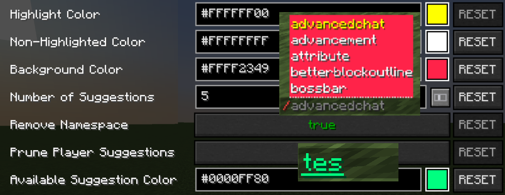
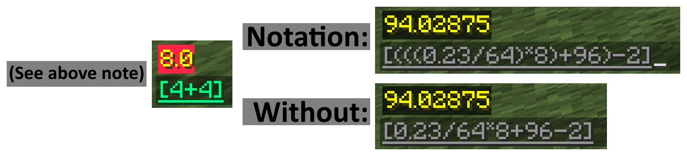
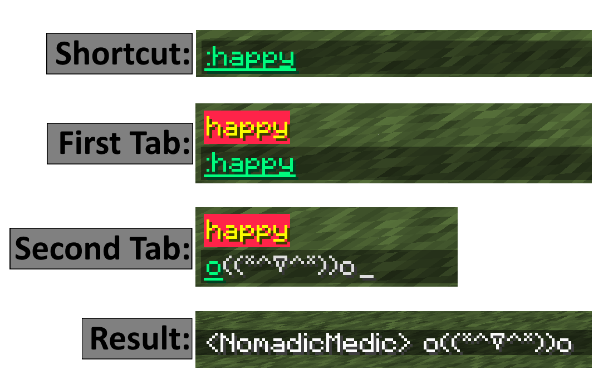
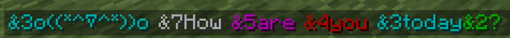
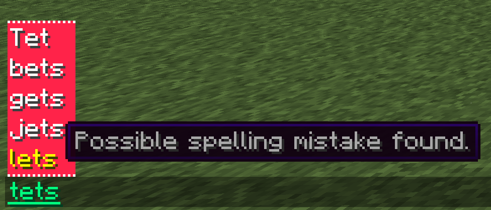

# AdvancedChat - ChatBox Module  
  

  

    Table of contents
  

  {: .text-delta }
1. TOC
{:toc}

---
### AdvancedChatBox
- Complex writing of messages and formatting in the text box.</b>

The information on this page is for the features of the ChatBox module of AdvancedChat. You can see the available sections in the Table of Contents, listed above.

---
## Available Tabs and Settings
{:toc}  
The following section will go over all the available tabs and settings in each tab that you can modify. This information can also be found [here](https://darkkronicle.github.io/AdvancedChatCore/modules/modulesOverview.html),
in the AdvancedChat-Modules Overview section. As well as overviews for all other modules available as of January 31st 2022.  

<u>ACC Page Guide</u>  
  

Once the mod is installed a **<u>Box</u>** tab will be added to the AdvancedChat Config Menu. As well as a cog button in the lower right of the screen when chat is opened that comes by default in the AdvancedChat Core. Located in that tab are the following;

***General Tab***  
Has two available buttons, Configure Suggestors, and Configure Formatters, as well as the following;
- Highlight Color - What color selected suggestions should be using Hex+Alpha values.
- Non-Highlighted Color - What color non-selected suggestions should be using Hex+Alpha values.
- Background Color - What color the background of the Chat Suggestor should be using Hex+Alpha values.
- Number of Suggestions - The maximum number of suggestions that the Chat Suggestor should display at once.
- Remove Namespace - Whether or not the namespace should be omitted from the Chat Suggestor. (The namespace is the part of the ID that precedes the colon and includes the colon, such as 'minecraft:' in minecraft:stone)
- Prune Player Suggestions - Whether or not non-real players are removed from Chat Suggestor. (Such as the fake players used in BungeeTabListPlus)
- Available Suggestion Color - What color custom chat suggestors will show up as (Hex+Alpha values.)

For the two buttons, the options are as follows;

***Configure Suggestors Button***
- Suggest Players - Whether or not player names are suggested in chat. Can be set to on or off.
- In-Chat Calculator - Whether or not the chat calculator is active. Can be set to on or off. (To use the chat calculator, put a math expression inside of brackets, and press tab in the brackets. Expressions follow the mXParser format.)
- Suggest Shortcuts - Whether or not shortcuts are suggested as you type. Can be set to on or off as well as configured to add or remove shortcuts. (Shortcuts are a way to bind a memorable phrase to a string of text, such as for emoticons. To use shortcuts, put a colon and the shortcut name, and press tab.)
- Spell Checker - Whether or not the spell-checker is active. 

***Configure Formatters Button***
- Custom Command Highlighting - Whether or not custom colors are used to highlight part of a command in Chat HUD. This may also be configured with; 
	- **Command Color** - What color a command is by default using Hex+Alpha values. 
	- **Error Color** - The color that highlights and incorrect command using Hex+Alpha values.
	- **Default Palette** - The palette the command colorer uses for parts of commands. Custom ones may be declared in the ~/minecraft/config/advancedchat/colors.toml file.
- Highlight JSON in Commands - whether or not JSON is parsed and highlighted in the Chat HUD.
- Color Code Formatting - Whether or not color codes with & are parsed and highlighted in their respected color.

***Spell Checker Tab***  
- Spell Checker Hover Format - The format of the text that appears when you hover your mouse over a suggested spelling change.

---  
## Settings Deep Dive  
{:toc}  
This section will take the above section, Available Tabs and Settings, and break down each one into their own separate sections to help fully understand what each one does respectively and in more easy to understand terms. As well as providing screen shots of their locations and more in-depth media in the Examples Sections located below.   
A note here quickly on the color values. ARGB and HEX+Alpha are the same, or rather very similar depending on who you ask. It's simply an 8 character string the comes after the pound sign(#) where the first two digits determine the alpha channel, aka the opacity of the color.

**General Tab**  
- Highlight Color - As the name suggests changing this ARGB value you alter what color is used to highlight the selected suggestion.
- Non-Highlighted Color - This option is the reverse of the above option. This ARGB value changes what color non-highlighted suggestions are.
- Background Color - For this option when you change the value you are adjust the background color of the suggestion.
- Number of Suggestions - This simply changes what the maximum amount of suggestions to be shown at once.
- Remove Namespace - Whether or not the things like 'minecraft:' should be show or hidden in suggestions. 
- Prune Player Suggestions - You can remove or keep suggested fake players from the suggestions list.
- Available Suggestion Color - What color your custom chat suggestions should show up as.

In this tab you will also find two buttons on the upper right side above the first option *Highlight Color*
**Configure Suggestors Button**
- Suggest Players - If you want player names to be suggested or not.
- In-Chat Calculator - Whether or not you want an in chat calculator active or not. It can be used by simply putting a math expression in brackets and pressing TAB which will give your answer as a suggestion. It should be noted that the In-chat calculator uses (mXparser)[https://darkkronicle.github.io/AdvancedChatCore/]. <!--This link will eventually point to the Common Knowledge - Math page on the Wiki  -->
- Suggest Shortcuts - When typing in chat you can have the option that when you type a certain string you can get a corresponding shortcut. so typing :happy then double tapping TAB will produce o((*^▽^*))o
	-When selecting the Configure option here you are taken to a page where you can see a full list of pre-added shortcuts which you can modify or remove. As well as the option to 'Add Shortcut' to modify. 
	-To modify a shortcut simply click the corresponding text box and change the character as you please.
- Spell Checker - whether or not you want the spell checker on or off.	

**Configure Formatters Button**
- Custom command Highlighting - Whether or not the below configured parameters are used.
	- Command Color	- What color a command is by default.
	- Error Color - The color that highlights an incorrect command.
	-Default Palette - The palette used by the above Command Color option for parts of commands. Custom ones can be added at ~/minecraft/config/advancedchat/colors.toml
- Highlight JSON in Commands - Whether or not you want your JSON parsed and highlighted in the [ChatHUD Module](https://darkkronicle.github.io/AdvancedChatCore/chatHUD/ChatHUD.html)
- Color Code Formatting - Decides if the color codes with & are parsed and highlighted in the correct color. 	
	
**Spell Checker Tab**
For spell checking typed words by default they will be underlined. At that point you can press TAB and you will be given a list of suggested changes that may be hovered over and scrolled through where you can receive the below information;     
- Spell Checker Hover Format - This is the format of how the text appears when you hover over a suggested spelling mistake or change. This follows a format where $1 is the first part of the description. $2 is the actual spelling suggestion and $3 is any additional information.

---
## Images and Examples
{:toc}
Assorted images and media to display different settings that are available to help keep the above cleaner looking. There is, if not already released, a mod showcase project in the works as well.

<u>Color Showcase</u>  
  

<u>Calculator (First image, 4+4, to show the color choice impact from the above Example Image. The other two images are default colors.)</u>   
  

<u>Shortcut</u>   
  

<u>Color Code Formatting</u>   

<u>Spell checker hover and color</u>   
  

<!--This documentation was written by Nomad on February 8th 2022-->
