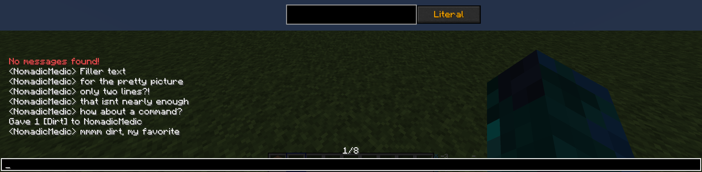
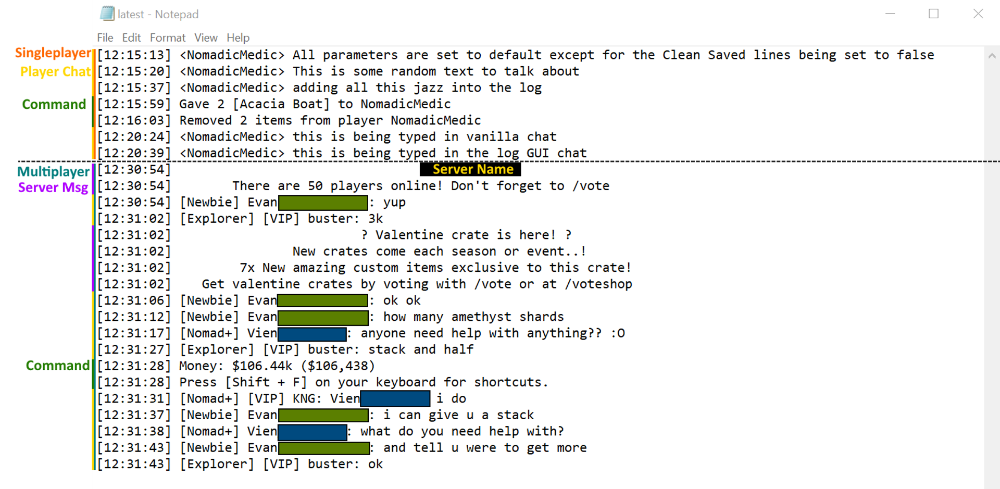

# AdvancedChat ChatLog Overview

  

    Table of contents
  

  {: .text-delta }
1. TOC
{:toc}

---

### AdvancedChatLog  
- View, store and sort through mass amounts of previous messages.
  
---
### Overview
{:toc}  
The information on this page is for the features of the **<u>ChatLog</u>** module of AdvancedChat. 
Once the mod is installed a **<u>Chat Log</u>** tab will be added to the AdvancedChat Config Menu, as well as a button in the chat GUI that looks like 3 stacked bars. 

**A bit of information**  
This mod allows you to not only store messages typed in game to a local file, but also allows the ability to leave the game either to the menu or to the desktop, and come back to your world with your previously sent messages.  
You can configure how many lines of chat are stored, as well as how many of those stored lines will be saved in order to be loaded the next time you play. Plus you can also search those saved lines in game via a chat GUI button.   

---
### Available Tabs and Settings  
{:toc}  
The following section will go over all the available tabs and settings in each tab that you can modify. This information can also be found [here](https://darkkronicle.github.io/AdvancedChatCore/modules/modulesOverview.html), in the Modules Overview section. As well as overviews for all other modules available as of January 31st 2022.  

***In Game Buttons**  
- The Chatlog module adds an additional button to the right of the UI that looks like 3 stacked bars once the chat is opened. That is used to view and search chat. The search options use the **Filter Type** button that cycles the options;
	- **Literal**, exact match. 
	- **Upper-Lower**, literal but not case-sensitive.
	- **RegEx**, Parses the strings as Regular Expression.
	- **Custom**, Allows for custom search parameters.  

<u>Log GUI</u>
 

***Chat Log Tab***
- Stored Lines - This value dictates how many lines of information are saved to the log file. Fair warning, large numbers may result in out of memory errors.  
- Saved - Lines - The amount of stored lines that are loaded when the game starts.
- Clean Saved Lines - When true this will make it so that the log doesn't save things like mouse clicks and movements to help reduce the logs file size.

<u>Log Tab</u>
 

**Output File**
- It should be noted that the location of the log output file is in your .minecraft folder, either in the directory in the 'chatlogs' folder or in your profiles 'chatlogs' folder. (*~/.minecraft/chatlogs/  -OR-  ~/.minecraft/MC_Profile_Name/chatlogs/*)  
 
<u>Log Output View</u>
   
---

<!--This documentation was written by Nomad on February 14th 2022 Happy Valentines Day <3 -->